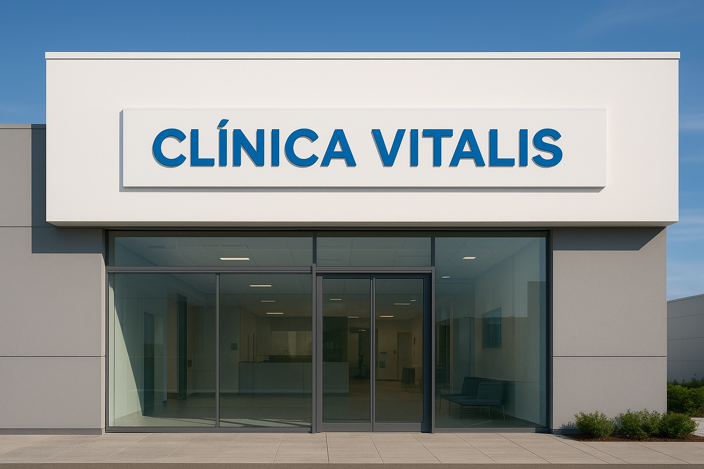

# Clínica Médica – Site Modelo

Projeto desenvolvido para praticar HTML e CSS, simulando um site institucional de uma clínica médica fictícia chamada **Vitallis**.

## 🧠 Objetivo
O foco deste projeto foi exercitar o uso de **estrutura semântica em HTML**, **organização de layout com CSS** e o uso de **boas práticas visuais e responsivas**.

## 🧩 Tecnologias utilizadas
- HTML5  
- CSS3  
- Visual Studio Code  

## 💡 Aprendizados
Durante o desenvolvimento, aprimorei meus conhecimentos em:
- Estruturação de páginas com várias seções (Home, Sobre, Contato, Serviços)
- Uso de `div`, `section` e `footer` corretamente
- Estilização e posicionamento com CSS
- Organização de arquivos e boas práticas no GitHub

## 📸 Prévia do projeto

## 📁 Estrutura do projeto
O projeto é composto por:
- **index.html** – Página inicial  
- **about.html** – Sobre a clínica  
- **service.html** – Serviços  
- **contact.html** – Página de contato  
- **base.css** – Estilo principal  

---

🧾 **Status:** Projeto finalizado e disponível para visualização do código.  
